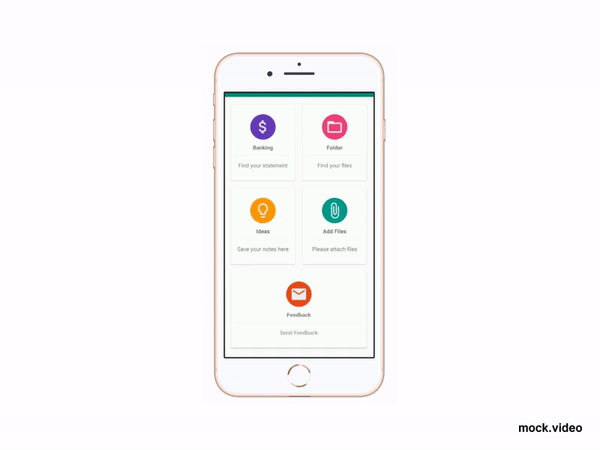

# Card View
Intregate Card View in your project 

<pre><code>
dependencies {
        implementation 'com.android.support:cardview-v7:28.0.0'
 }
</code></pre>

<li>Android CardView got introduced in Android Lollipop with Material Design. For those who’re not aware of Material Design, its a comprehensive guide of
UI Widgets introduced since Android 5.0 and it improves the visual appeal of the apps.</li>

